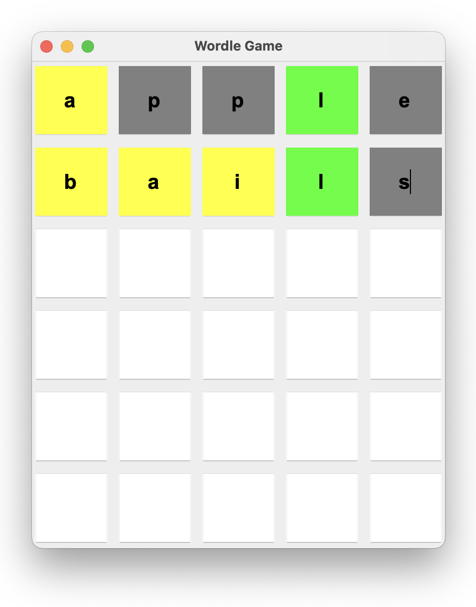
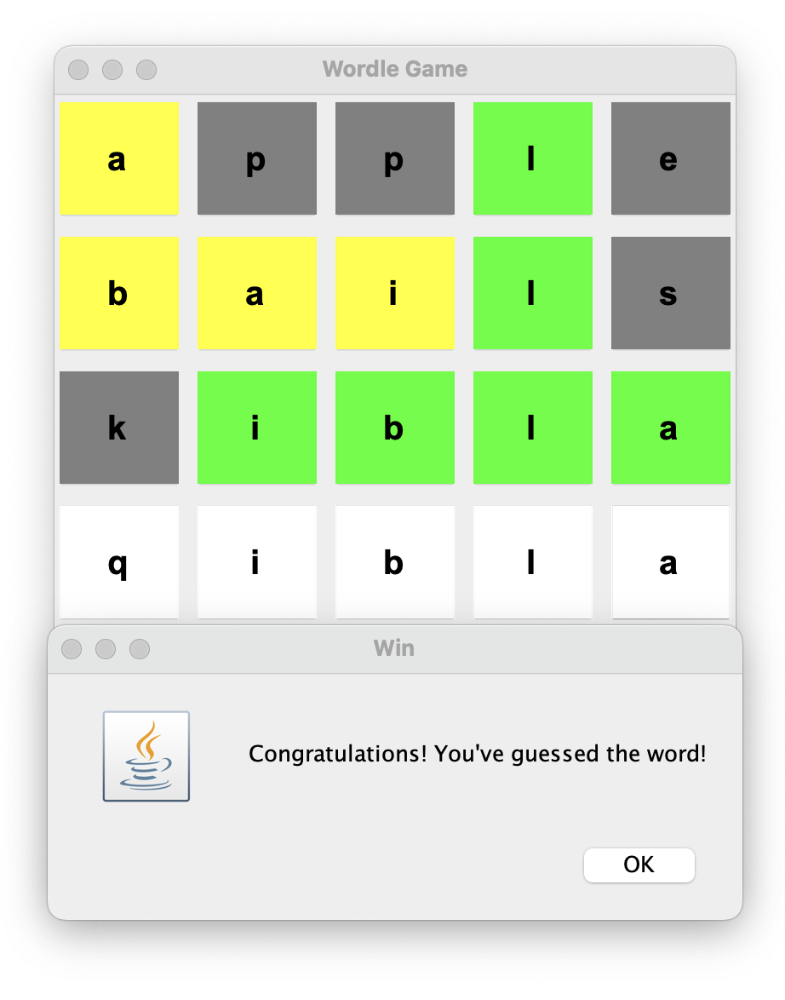

# Wordle Game In Java

This Wordle game project, implemented in Java using Eclipse, is a graphical word-guessing game inspired by the popular Wordle game. The project utilizes the Swing library for creating the graphical user interface (GUI), which includes a grid for letter input, color feedback, and controls for user interaction. The game reads a list of valid 5-letter words from a text file, randomly selects one as the target word, and allows the player to guess it within six attempts. The application features smooth interaction with text fields, where users input letters directly into the grid, and uses event listeners for handling actions like word submission and backspace functionality. Additionally, the project incorporates key Java concepts like object-oriented programming, file handling, and event-driven programming, providing an interactive and visually engaging user experience.

<table style="border-collapse: separate; border-spacing: 20px;">
    <tr>
        <td></td>
        <td></td>
    </tr>
</table>
